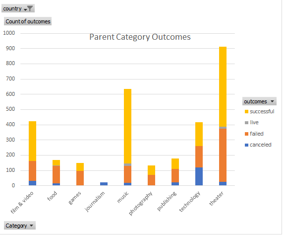
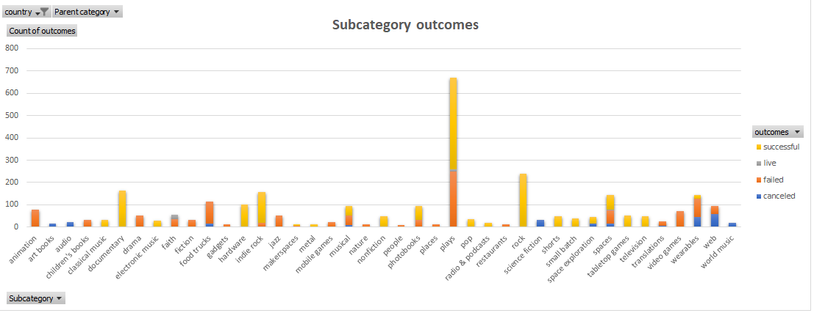
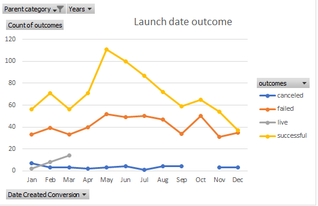
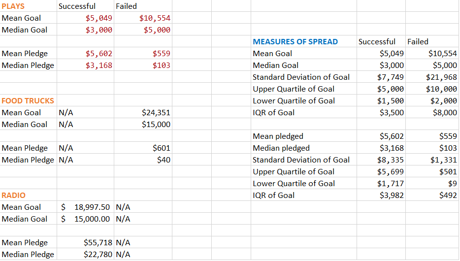
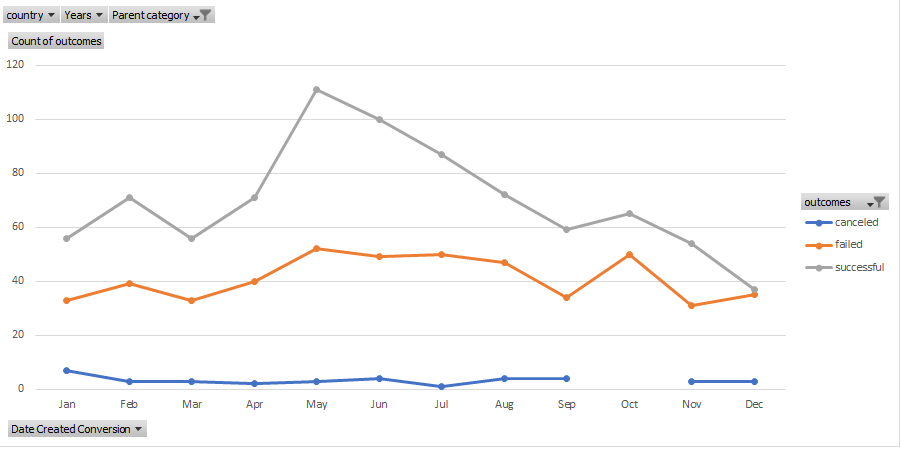
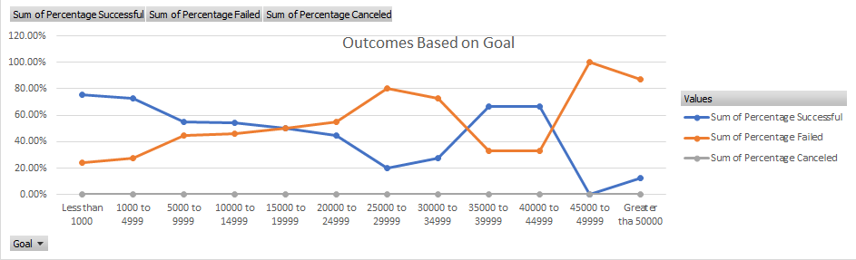

# Kickstarting with Excel

## Overview of Project
Performing analysis on crowdfunding projects data, consisting of many categories (from foodtrucks to drama series) to uncover trends among several features such as money goals, pledge amounts, launch dates, in order to reveal the relationship these have with the outcome of the campaign( failed, successful, canceled). 

### Purpose
Find trends among different kickstarter campaigns, in order to help Louise decide on achiveable goals, pointing her in the right direction to raise funds for a play she is interested in bringin to life.

## Analysis and Challenges
We calculated the averages donations using the ROUND function, dividng the pledged between the number of backers
- Averages (=ROUND(E2/D2*100,0))
When the value in the pledged and backers columns was 0, we found an error (#DIV/0!)
- Trouble shooting (#DIV/0!) dividing by cero (=IFERROR(ROUND(E2/L2,2),0))

Creating pivot tables 
- Parent category outcomes

- Subcategory outcomes 

-General success vs launch date (all categories included)

Using measure of central tendency 
 - =AVERAGE('Successful US Kickstarters'!D:D)
 - =MEDIAN('Successful US Kickstarters'!D:D)

Measures of spread
 - =STDEV.P('Successful US Kickstarters'!D:D)
 - =QUARTILE.EXC('Successful US Kickstarters'!D:D, 3)
 - =QUARTILE.EXC('Successful US Kickstarters'!D:D, 1)
 
 
 

### Analysis of Outcomes Based on Launch Date

### Analysis of Outcomes Based on Goals

### Challenges and Difficulties Encountered
 -Editing labels and y-axis values as well as units came across as a challenge, but were able to figure it out. 
 - Also oushing several changes on the local repo to the remote, at n epoint i just erased everything and made a new one, couldn't find a quicker answer.

## Results

- What are two conclusions you can draw about the Outcomes based on Launch Date?
 1. Overall, theater, and spexcially "plays" subcategory, has a significant level of success (66%) throughout the year
 2. The months of may and june seemed as the most appropaiate to launch a fundraising. Avoid at all cost staring near the end of the year (the lowest succes rate was registered on december)

- What can you conclude about the Outcomes based on Goals?
 1. The highest success came from campaigns with a budget of less than a thousand dollars. The second best succes rate if from plays which had a goal between 1000 and 5000 dollars.
 2. I think Louise's chance is a fifty-fifty right now, so she could consider maybe cut some of her expenses, use  resources to get the right writers to make a good script and definetly get somebody on social media to advertise the play se wants to present. Get potential backers interested. 

- What are some limitations of this dataset?
 1. I think it would be helpful to hace additional informationabout successful campaings, such as an expense breakdwon, so we could see how they managed the pledged amounts; we might see some aspects of these successful projects, that, initially, we were not taking in consideration, thus making sure we distribute resources in the best way possible.
 2. Maybe give a little details whrn describing what the campaign is about, I am lookong at the food category.

 - What are some other possible tables and/or graphs that we could create?
 
  1.The best season to launch a kickstarter if my goal is set up a food truck around the world 
  2.The most succesful campaigns (by parent and subcategory) with individual goals by country and by launch date.

